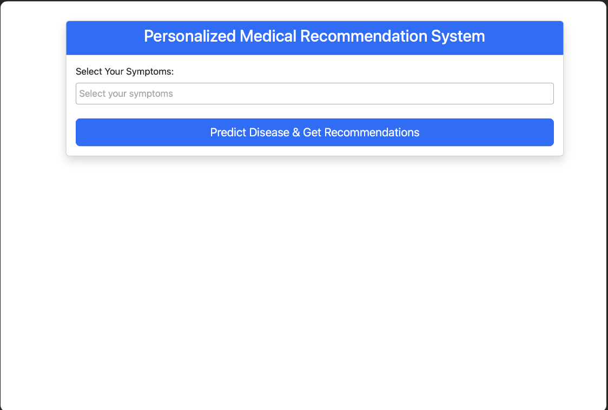

# 🏥 Healthcare Disease Prediction & Recommendation System

An AI-powered healthcare web application that predicts possible diseases based on user-provided symptoms and provides personalized recommendations such as precautions, medications, diet, and workout suggestions.

## 📌 Project Overview

The **Healthcare Disease Prediction & Recommendation System** is a machine learning-based Flask web application designed to assist users in understanding possible health conditions based on their symptoms.

The application uses a trained machine learning model to predict the most likely disease and then provides relevant healthcare recommendations, including:

* 🩺 Predicted disease
* 💊 Recommended medications
* ⚠️ Precautions to consider
* 🥗 Recommended diet
* 🏃 Recommended workouts
* 📋 Disease-related information

> **Disclaimer:** This project is developed for educational and demonstration purposes only. It is not intended to replace professional medical advice, diagnosis, or treatment.

---

## ✨ Features

* 🔍 **Symptom-based disease prediction**
* 🤖 Machine learning-based prediction model
* 💊 Medication recommendations
* ⚠️ Precaution recommendations
* 🥗 Diet recommendations
* 🏃 Workout recommendations
* 📚 Disease description and information
* 🌐 Interactive Flask web interface
* 📊 Dataset-based healthcare analysis
* 📓 Jupyter Notebook for model/data exploration

---

## 🛠️ Technologies Used

### Programming & Development

* **Python**
* **Flask**
* **HTML**
* **CSS**
* **JavaScript**

### Machine Learning & Data Processing

* **Pandas**
* **NumPy**
* **Scikit-learn**
* **Jupyter Notebook**

### Model & Data

* Trained machine learning models
* CSV datasets
* Pickle (`.pkl`) model files

---

## 📂 Project Structure

```text
Healthcare_Project/
│
├── Dataset/
│   ├── Symptom-severity.csv
│   ├── Training.csv
│   ├── description.csv
│   ├── diets.csv
│   ├── medications.csv
│   ├── precautions_df.csv
│   ├── symtoms_df.csv
│   ├── synthetic_medical_dataset.csv
│   ├── weight-height.csv
│   └── workout_df.csv
│
├── data/
│   └── description.csv
│
├── models/
│   ├── description.pkl
│   ├── diets.pkl
│   ├── disease_model.pkl
│   ├── medications.pkl
│   ├── precautions.pkl
│   ├── svc.pkl
│   ├── symptom_list.pkl
│   └── workouts.pkl
│
├── static/
│   ├── css/
│   │   ├── medical.css
│   │   ├── script.js
│   │   └── style.css
│   └── logo-blue.png
│
├── templates/
│   ├── index.html
│   └── results.html
│
├── Healthcare_project.ipynb
├── app.py
├── generate_pickles.py
├── load_model.py
├── requirements.txt
└── README.md
```

---

## ⚙️ Installation & Setup

### 1. Clone the repository

```bash
git clone https://github.com/Devanshirana/Healthcare_Project.git
```

### 2. Navigate to the project directory

```bash
cd Healthcare_Project
```

### 3. Create a virtual environment

```bash
python3 -m venv venv
```

### 4. Activate the virtual environment

**macOS / Linux:**

```bash
source venv/bin/activate
```

**Windows:**

```bash
venv\Scripts\activate
```

### 5. Install dependencies

```bash
pip install -r requirements.txt
```

### 6. Run the application

```bash
python app.py
```

The application should then be available at:

```text
http://127.0.0.1:5000/
```

---

## 🧠 How It Works

The application follows a simple machine learning workflow:

```text
User enters symptoms
        ↓
Symptoms are processed
        ↓
Machine Learning Model
        ↓
Disease Prediction
        ↓
Recommendation Data Retrieved
        ↓
Results displayed through Flask Web App
```

The trained models stored in the `models/` directory are used by the Flask application to generate predictions and retrieve related healthcare recommendations.

---

## 📊 Dataset

The project contains multiple healthcare-related datasets covering:

* Symptoms
* Disease information
* Symptom severity
* Medications
* Precautions
* Diet recommendations
* Workout recommendations
* Synthetic medical data
* Weight and height data

These datasets support the prediction and recommendation components of the application.

---

## 🖥️ Application Screenshots

### Home Page

Add your application screenshot here:

```markdown

```

You can also add additional screenshots from the project:

```markdown

```

---

## 🔮 Future Improvements

Some possible improvements for future versions include:

* Improve prediction accuracy with additional datasets
* Add user authentication
* Store user prediction history
* Add more diseases and symptoms
* Develop a responsive mobile-friendly interface
* Deploy the application using a cloud platform
* Add visualization of prediction confidence
* Integrate a conversational healthcare assistant
* Improve recommendation personalization

---

## 🎯 Learning Outcomes

Through this project, I worked with:

* Machine learning model development
* Data preprocessing and handling
* Python-based application development
* Flask web application development
* Model serialization using Pickle
* HTML/CSS/JavaScript integration
* Dataset management
* Connecting machine learning models with a web interface
* Git and GitHub for project version control

---

## 👩‍💻 Author

**Devanshi Rana**

Computer Science & Engineering Graduate
Interested in **Data Analytics, Machine Learning, Python, SQL, and Software Development**.

---

## ⭐ Acknowledgement

This project was developed as an academic/learning project to explore the practical implementation of machine learning in a healthcare-related application.

If you find this project useful or interesting, consider giving the repository a ⭐.
